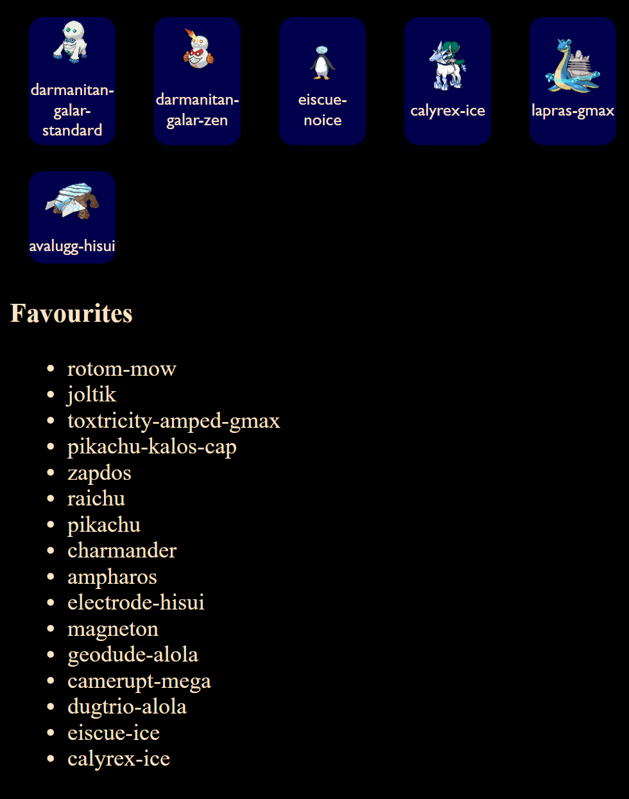

# Pokedex

The site can be viewed live for users connected to the NTNU VPN or Eduroam network [here](it2810-56.idi.ntnu.no)


## Features

### Poke-profile

Displays name, image and a few facts about a pokemon of your choice.<br>
Allows you to mark a pokemon as your favorite for easier retrieval later.<br>

Favorites are listed at the bottom of the page. Make sure you're confident in your choice though! Once added, they can't
be removed!<br>


A simplistic design with some basic information was decided on to meet the MVP functional and technical specs as
described in the project description.

### Navbar

Allows for easy filtration of pokemon types in the pokegrid.<br>
We originally planned for types to be chosen by clicking on buttons with icons, but having 18 available types would mean
a very crowded navbar which would make for a bad experience for mobile users. A dropdown makes the selection more
available for all platforms at the cost of being less stylish.

### Pokegrid

The shopping window of the app. Allows the user to scroll through the pokemon within a type and click on them to view
their poke-profiles.

## How to run

### Requirements

This project was developed using ``Node 20.5`` and ``npm 9.5``<br>
We can't guarantee compatibility for other versions.<br>
For other version requirement questions, refer to the ``package.json`` file<br>

### Instructions

Clone the repo to your local machine and navigate to the base folder of the repo(the one containing this file)<br>
Run ``npm install``<br>
Once that completes, you should be able to spin up a local dev server using;<br>
```npm run dev```. CTRL+Click the link in your terminal or navigate to the url in your browser to view the site.<br>

## Testing

Tests can be run using `npx vitest`

We have added quite limited testing, mostly just to try out the concept.<br>
Our current suite includes the following tests;<br>
Navbar - Assert that the navbar is rendered with the text "Pokedex" and that the dropdown in the navbar has 18
elements<br>
Pokeprofile - Render a pokeprofile object using data from mock service worker and check the content is correct.

### Testing tools;

[Mock service worker](https://mswjs.io/)<br>
[Vitest](https://vitest.dev/)<br>
[React testing library](https://testing-library.com/docs/react-testing-library)<br>
